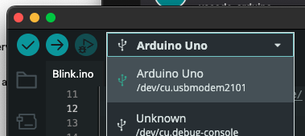
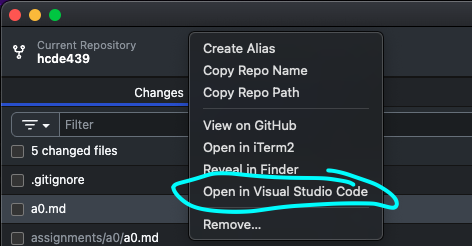

# A0: Webpage and IDE setup!

In this assignment you will:

- Install the Arduino IDE
- Install Git and make a Github account
- Set up and deploy a personal portfolio site to document your work in the class
- Install VS Code and some extensions

If you run into any issues, please ask questions in the [#⁠🐞-troubleshooting](https://discord.com/channels/1454967131262423113/1454996901043769374)
channel on Discord. If you solve an issue or learn something that might help
your fellow classmates, please post it in the [#⁠🤯-today-i-learned](https://discord.com/channels/1454967131262423113/1454997497520062494) channel.

> [!TIP]
> What to turn in for Assignment 0: Submit a link to your portfolio website on canvas.

## Arduino Installation

Download the Arduino IDE [here](https://www.arduino.cc/en/software). It should be the first download button on the page.
Install it
and make sure it works:

- Open up the "Blink" sketch under example projects
  
- Plug in your Arduino board (in your kit, this is the Elegoo Uno R3, and it uses the included blue USB-A to USB-B cable) and select the correct board in the drop down
  
- Click the check button in the upper left (this makes sure you are able to
  verify/compile it)

## Git Installation

Put all that arduino stuff away for the rest of the assignment.
[Make a Github account](https://github.com/) and
[install Github Desktop](https://desktop.github.com/). This should install git,
but in past classes some people using MacOS ran into an issue where git did not
install correctly. If you are having issues with git, try following
[this guide](https://github.com/git-guides/install-git) for your operating
system.

## Fork this example repository

Fork this repository to create your own copy under your Github account. In your web browser, go to https://github.com/paulate/hcde439 and click the "Fork" button in the upper right. This will create a copy of this repository in your own Github account. In the next page, you can leave the defaults set and click "Create fork".

## Clone your repository

If you are experienced with git and Github and comfortable using the command line, you may do these steps using git commands. If not, follow the instructions below for using Github Desktop.

Once you have Github Desktop installed, you can clone this example repository
to your computer. In Github Desktop, go to `File > Clone Repository...`, then
select the `URL` tab. Copy and paste the URL of your repository (e.g. https://github.com/<your-username>/hcde439) into the box and click "Clone". Select "for my own purposes" if prompted.

### Optional: Add to the .gitignore file

When using git, there are certain files you generally do not want to commit to
your repository. For example, on MacOS, `.DS_Store` files are automatically
created by the operating system to store folder view options. These files are
not useful to include in your repository.

If you see a file you do not want to commit showing up in your list of changes, left click on it and select "Ignore file". This will create a `.gitignore` file in your repository that tells git to ignore those files in the future. [Read more about ignoring files.](https://help.github.com/en/github/using-git/ignoring-files).

## VS Code Installation

We will be using Visual Studio Code (generally shortened to VS Code). VS Code is
a _highly extensible_ text editor. This means that its base function is quite
simple: you can open and edit files. You can install extensions via the
extension marketplace, which let you add bits of functionality as you need them,
such as support for different languages.

[Download and install Visual Studio Code.](https://code.visualstudio.com/).

If you have a different editor preference (e.g., Sublime), you are welcome to
use it.

Once you have installed VSCode, sign in with your Github account.

Install the following three extensions (helpful for the basic web development we
will be doing) from the extension marketplace:

- [Live Server](https://marketplace.visualstudio.com/items?itemName=ritwickdey.LiveServer)
- [Prettier](https://marketplace.visualstudio.com/items?itemName=esbenp.prettier-vscode)
- [ESLint](https://marketplace.visualstudio.com/items?itemName=dbaeumer.vscode-eslint)

Optionally, do a bit of customization and install a color theme! There are many VS
Code themes available. For fun, peruse a few (you can do this by clicking the
"filter" button and choosing `Category > Themes`) and pick one.

## Your first commit and push

Open the repository you cloned earlier in VS Code: in Github Desktop, right click on the repository name in the left sidebar and select "Open in Visual Studio".

Alternatively, you can open VS Code first and open the folder
by going to `File > Open Folder...` and
selecting the folder where you cloned the repository. You should see the files of the repo in the explorer sidebar on the left.

Open the `README.md` file in VS Code. Change "Instructor: Paula Te" to "Student: [Your Name]", and save the file.

There are multiple ways to commit and push your changes to Github. Here are two
ways to do it: using VSCode's built-in source control interface, or using Github Desktop. You can also commit and push your work from the
command line if you are comfortable using it.

### Option 1: Using Github Desktop

Go back to Github Desktop. You should see that the `README.md` file shows up
in the list of changes. Enter a commit message (e.g., "First commit: added my name") and click the "Commit to main" button. Finally, click the "Push origin" button at the top to push your changes to Github's servers. If you go to the repository page on Github in your web browser, you should see your changes reflected there.

### Option 2: Using VSCode Source Control

These are instructions to commit and push your changes using VSCode's built-in
source control interface.

1. Open the "Source control" panel in VS Code's left sidebar. You should see a
   list of changes you have made. This panel shows information similar to the
   output of the command `git status`.
2. Hover over the header that says "Changes". You should see a Plus icon (+)
   appear to the right. Click it to stage your changes. This is the equivalent
   to running `git add --all` or `git add .` in the terminal.
3. Enter a commit message (e.g. "First commit: added my name") in the text entry
   box above (which should say "message"), and click the "Commit" button. This
   is equivalent to running `git commit -m "my commit message"` in the terminal.
4. The "Commit" button should turn into a button that says "sync changes" -
   click it. This is equivalent to running `git push`. This will push your work
   to your remote repository that is stored on Github's servers.
5. If you go to the repository page on Github in your web browser, you should see your changes reflected there.

## Github Pages Setup

We will be using Github pages to host the portfolio sites where you will
document your work for the class.

Go back to your Github repo in your web browser (e.g. https://github.com/<your-username>/hcde439). Click on the "Settings" tab at the
top of the page (next to Insights). In the left sidebar, click on "Pages". Under "Branch", select
"main" as the branch and "/docs" as the folder. Click "Save". Your site should be
published at `username.github.io/hcde439` (wait a few minutes for it to go live).

Everything in the docs folder in the HCDE439 repo is now available live on your site!

Every time you make changes to your site and push them to Github, this will
automatically publish any changes you made to your site.

## Working on your site!!

Now our fun index.html template is being published at your url. But we don't want our silly text to be up there;
it's time to customize your site!

In VSCode, assuming you have installed the VSCode Live Server extension, right click on `index.html` (in the `docs` folder) in the explorer side bar and
click "Open with Live Server". The page should open automatically in your
browser. You can now edit the files containing your site code and your changes
will immediately update the browser. This gives you a way to easily preview what your site looks like as you save your changes locally before pushing your changes and publishing to the web.

Start by reading through the HTML in `docs/index.html` understanding how each portion corresponds to what you see in your
browser. You can now begin editing your site by tweaking the template.

Edit the index.html file to include your name and 1-2 sentences about yourself.
Replace the image of a red panda with an image of yourself (or an avatar).

When you are done, commit and push to github to publish your changes! Turn in a link to your site on Canvas.

### Resources

Here are some resources you can use while you customize your site. The MDN Web
docs are a fantastic resource and one of my personal favorites. Their
[getting started guide](https://developer.mozilla.org/en-US/docs/Learn/Getting_started_with_the_web)
is a great introduction to these various technologies and how they fit together.
The "Getting started" covers most of what you might need to know when editing
your site to turn in your work, particularly the following articles:

- [Dealing with files](https://developer.mozilla.org/en-US/docs/Learn/Getting_started_with_the_web/Dealing_with_files) -
  to understand how files are structured
- [HTML Basics](https://developer.mozilla.org/en-US/docs/Learn/Getting_started_with_the_web/HTML_basics) -
  to get an overview of how an HTML document is structured and what tags are
  available to you
- [CSS Basics](https://developer.mozilla.org/en-US/docs/Learn/Getting_started_with_the_web/CSS_basics) -
  to understand how HTML can be styled
- [How the web works](https://developer.mozilla.org/en-US/docs/Learn/Getting_started_with_the_web/How_the_Web_works) -
  to understand the grand scheme

The following sections on HTML and CSS are much longer. Look at the topics
listed in the sidebar and feel free to read any articles that look interesting.
The articles that are probably most useful for you in this class are:

- [HTML: Creating hyperlinks](https://developer.mozilla.org/en-US/docs/Learn/HTML/Introduction_to_HTML/Creating_hyperlinks)
- [HTML: Images](https://developer.mozilla.org/en-US/docs/Learn/HTML/Multimedia_and_embedding/Images_in_HTML)
- [HTML: Debugging](https://developer.mozilla.org/en-US/docs/Learn/HTML/Introduction_to_HTML/Debugging_HTML)
- [CSS: Text and Font Styling](https://developer.mozilla.org/en-US/docs/Learn/CSS/Styling_text/Fundamentals)
- [CSS: Sizing](https://developer.mozilla.org/en-US/docs/Learn/CSS/Building_blocks/Sizing_items_in_CSS)
- [CSS: Layout](https://developer.mozilla.org/en-US/docs/Learn/CSS/CSS_layout/Introduction)
- [CSS: Debugging](https://developer.mozilla.org/en-US/docs/Learn/CSS/Building_blocks/Debugging_CSS)
- [CSS: Transitions](https://developer.mozilla.org/en-US/docs/Web/CSS/CSS_Transitions/Using_CSS_transitions)

## Additional resources

- [HTML elements reference](https://developer.mozilla.org/en-US/docs/Web/HTML/Element)
- [CSS selectors overview](https://developer.mozilla.org/en-US/docs/Learn/CSS/Building_blocks/Selectors)
- [CSS cheat sheet](https://websitesetup.org/wp-content/uploads/2019/11/wsu-css-cheat-sheet-gdocs.pdf)
